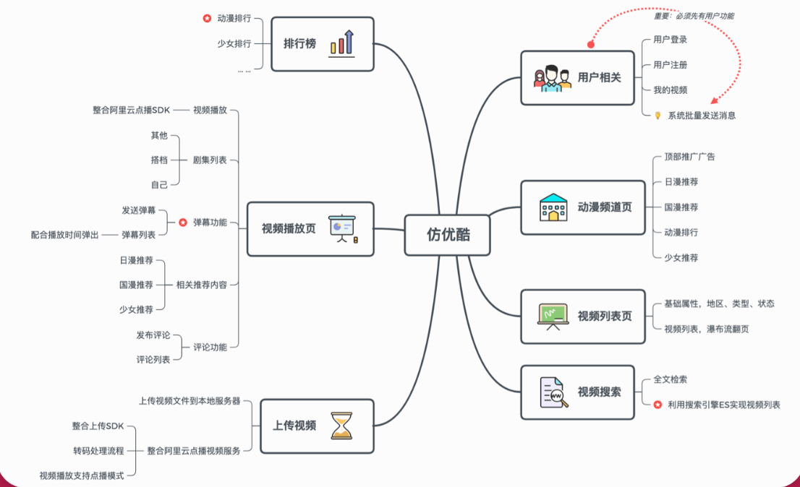
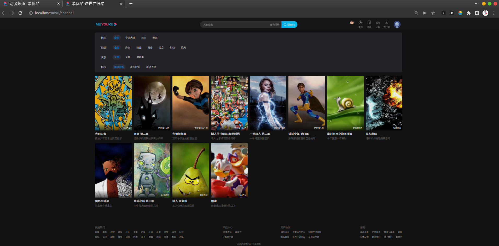

<!--
 * @Description:
 * @Author: neozhang
 * @Date: 2022-01-06 23:46:07
 * @LastEditors: neozhang
 * @LastEditTime: 2022-04-23 21:40:58
-->
# 慕优酷网站  

以 “优酷网”为蓝本 ，基于PHP构建“慕优酷网”， 后进行Go改造。  

  

## 技术栈  

- Go  
- PHP  
- MySQL
- Redis  
- RabbitMQ  
- Elasticsearch  

## 演示  

- `clone`本项目  
```
$ git clone fyouku
```

- 运行前端：  
```
$ cd fyouku/
$ bee run
```

- 运行后端：  
```
$ cd fyoukuApi/
$ bee run
```

- 查看效果  
访问`localhost:8098`  
  
  

[电子书文档地址](http://book.qingwakong.com/fyouku/4.9.html)  