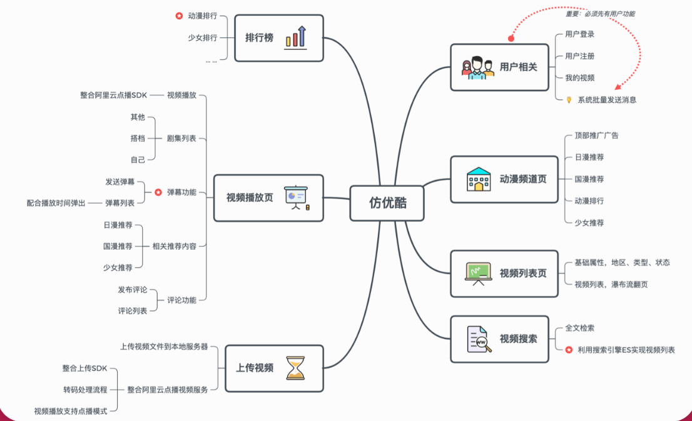

<!--
 * @Description:
 * @Author: neozhang
 * @Date: 2022-01-06 23:46:07
 * @LastEditors: neozhang
 * @LastEditTime: 2022-04-23 11:44:32
-->
# 慕优酷网站  

以 “优酷网”为蓝本 ，基于PHP构建“慕优酷网”， 后进行Go改造。  

## 技术栈  

- Go  
- PHP  
- MySQL
- Redis  
- RabbitMQ  
- Elasticsearch  

  

[电子书文档地址](http://book.qingwakong.com/fyouku/4.9.html)  