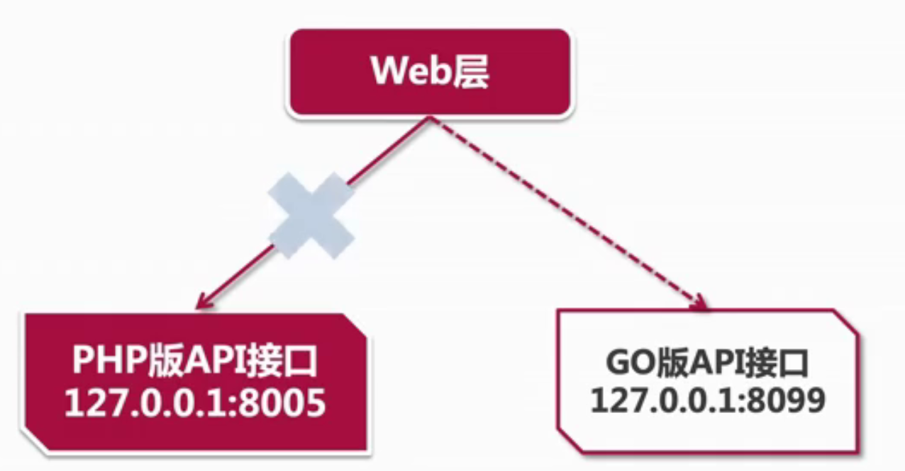

<!--
 * @Description: 
 * @Author: neozhang
 * @Date: 2022-04-23 19:03:03
 * @LastEditors: neozhang
 * @LastEditTime: 2022-04-23 19:06:40
-->
## 改造流程  

  

## 改造思路  

- 整理出原有接口的请求参数和返回数据信息  
- 分析原有代码了解业务逻辑  
- 不改变请求参数和返回数据的前提下，实现功能  